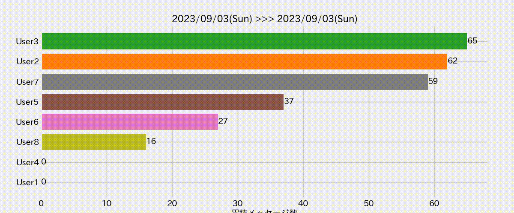

# line-chat-visualizer

LINE のトーク履歴を解析し、グラフや動画を作成するスクリプトです。



## Requirements

- matplotlib
- moviepy
- japanize_matplotlib (日本語のフォントを使用する場合)

```
pip install matplotlib moviepy japanize_matplotlib
```

## How to use

### 1. LINE のトークファイルをエクスポートする

LINE のトーク画面からメニューを開き、その他 > トーク履歴の送信 からテキストファイルを作成します。
作成が完了したら、一度 Keep に保存してからダウンロードします。

### 2. トーク履歴を解析する

```
python3 index.py
```

```python3
90| line_chat_file_path = "text.txt" # ここにLINEのトーク履歴のテキストファイルを指定
91| output_video_path = "line_chat_video.mp4" # ここに出力する動画ファイル名を指定
```
